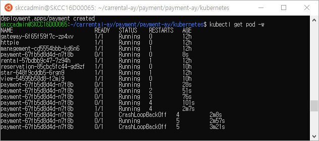

# 2조 과제 - 렌터카 서비스

### Table of contents

- [과제 - 렌터카 서비스](#---)
  - [서비스 시나리오](#서비스-시나리오)
  - [분석/설계](#분석설계)
  - [구현:](#구현-)
    - [DDD 의 적용](#ddd-의-적용)
    - [폴리글랏 퍼시스턴스](#폴리글랏-퍼시스턴스)
    - [폴리글랏 프로그래밍](#폴리글랏-프로그래밍)
    - [동기식 호출 과 Fallback 처리](#동기식-호출-과-Fallback-처리)
    - [비동기식 호출 과 Eventual Consistency](#비동기식-호출-과-Eventual-Consistency)
  - [운영](#운영)
    - [CI/CD 설정](#cicd설정)
    - [동기식 호출 / 서킷 브레이킹 / 장애격리](#동기식-호출-서킷-브레이킹-장애격리)
    - [오토스케일 아웃](#오토스케일-아웃)
    - [무정지 재배포](#무정지-재배포)
  
---
# 서비스 시나리오

## 기능적 요구사항
1. 관리자는 대여 차량 정보를 등록/삭제 할 수 있다.
1. 고객은 차량의 정보를 조회할 수 있다.
1. 고객은 차량을 선택해 예약할 수 있다.
1. 고객은 예약한 정보를 예약취소 할 수 있다.
1. 고객이 예약 차량에 대해 결제를 완료하면 차량이 대여된다.
1. 고객이 결제를 취소하면 차량 대여정보도 취소된다.
1. 예약/결제/대여가 발생하면 차량의 상태가 변경된다.
1. 고객은 대여 진행 현황을 중간에 조회할 수 있다.


## 비기능적 요구사항
1. 트랜잭션
    1. 결제가 되지 않은 예약건은 차량 대여가 성립하지 않는다. (Sync 호출)
1. 장애격리
    1. 관리자 차량관리 기능이 수행되지 않더라도 예약은 항상 받을 수 있어야 한다. (Async:Event-driven, Eventual Consistency)
    1. 결제시스템이 과중되면 사용자를 잠시동안 받지 않고 결제를 잠시후에 하도록 유도한다. (Circuit breaker, fallback)
1. 성능
    1. 고객이 대여 현황을 예약 시스템에서 항상 확인 할 수 있어야 한다. (CQRS)
    1. 결제, 대여/반납 정보가 변경 될 때 마다 차량 재고가 변경될 수 있어야 한다. (Event driven)

---
# 분석/설계

## Event Storming 결과
* MSAEz 로 모델링한 이벤트스토밍 결과:  http://msaez.io/#/storming/YwOQgvEmhERptfuUxzgz2bPRQ5L2/share/e704bbe175813f193c92819f141a16a3/-MDn_Bksfd3DwJHUdzY

### 이벤트 도출


### 어그리게잇으로 묶기

  - 차량 예약, 결제, 대여, 차량관리 등은 그와 연결된 command 와 event 들에 의하여 트랜잭션이 유지되어야 하는 단위로 그들 끼리 묶어주었다.


### 바운디드 컨텍스트로 묶기


  - 도메인 서열 분리 
      - Core Domain: reservation, rental 은 핵심 코어 서비스로 연간 Up-time SLA 수준을 99.999% 목표, 배포주기는 reservation 의 경우 1주일 1회 미만, rental 의 경우 1개월 1회 미만
      - Supporting Domain: management 은 차량 관리 관련 경쟁력을 내기 위한 서비스이며, SLA 수준은 연간 60% 이상 uptime 목표, 배포 주기는 각 팀의 자율이나 표준 스프린트 주기가 1주일 이므로 1주일 1회 이상을 기준으로 함.
      - General Domain: payment 결제서비스로 3rd Party 외부 서비스를 사용하는 것이 경쟁력이 높음 (핑크색으로 이후 전환할 예정)

### 폴리시 부착 (괄호는 수행주체, 폴리시 부착을 둘째단계에서 해놔도 상관 없음. 전체 연계가 초기에 드러남)


### 폴리시의 이동과 컨텍스트 매핑 (점선은 Pub/Sub, 실선은 Req/Resp)


### 완성된 1차 모형


### 1차 완성본에 대한 기능적/비기능적 요구사항을 커버하는지 검증


  - 고객이 차량을 선택해 예약한다. (OK)
  - 고객이 예약한 차량을 결제한다. (OK)
  - 결제가 성공하면 차량이 대여 된다. (OK)
  - 대여된 차량은 차량 관리(인벤토리)에 차량상태 변경(대여중) 처리 된다. (OK)


  - 고객이 예약한 렌트 차량을 취소할 수 있다. (OK)
  - 고객이 예약 취소가 되면 차량 대여 취소된다. (OK)
  - 고객은 차량 정보를 조회할 수 있다. (?) 
  - 고객은 대여 진행 현황을 중간에 확인할 수 있다. (?)


### 모델 수정


    
- 수정된 모델은 모든 요구사항을 커버함.


### 비기능 요구사항에 대한 검증


  - 마이크로 서비스를 넘나드는 시나리오에 대한 트랜잭션 처리
    - 차량 예약과 동시에 결제 처리 : 결제가 완료되지 않은 차량 대여는 불가, ACID 트랜잭션 적용, 예약 완료시 결제 처리에 대해서 Req-Res 방식 처리.   
    - 결제 완료 시 대여 및 차량관리의 상태 변경 : rental에서 마이크로 서비스가 별도의 배포주기를 가지기 때문에 Eventual Consistency 방식으로 트랜잭션 처리함.   
    - 나머지 모든 inter-microservice 트랜잭션: rental 및 management 이벤트에 대해, 데이터 일관성의 시점이 크리티컬하지 않은 모든 경우가 대부분이라 판단, Eventual Consistency 를 기본으로 채택함.
    
    
    
---
## 헥사고날 아키텍처 다이어그램 도출
    


- Chris Richardson, MSA Patterns 참고하여 Inbound adaptor와 Outbound adaptor를 구분함
- 호출관계에서 Pub/Sub 과 Req/Res 를 구분함
- 서브 도메인과 바운디드 컨텍스트의 분리: 각 팀의 KPI 별로 아래와 같이 관심 구현 스토리를 나눠가짐


---
# 구현
분석/설계 단계에서 도출된 헥사고날 아키텍처에 따라, 각 BC별로 대변되는 마이크로 서비스들을 스프링부트와 자바로 구현하였다.    
구현한 각 서비스를 로컬에서 실행하는 방법은 아래와 같다 (각자의 포트넘버는 8081 ~ 808n 이다)
```
cd gateway
mvn spring-boot:run  

cd reservation
mvn spring-boot:run 

cd payment
mvn spring-boot:run  

cd rental
mvn spring-boot:run

cd management
mvn spring-boot:run  

cd view
mvn spring-boot:run  


```


---
## DDD 의 적용
- 각 서비스내에 도출된 핵심 Aggregate Root 객체를 Entity 로 선언
```
package carrental;

import org.springframework.beans.BeanUtils;

import javax.persistence.*;

@Entity
@Table(name="Payment_table")
public class Payment {

    @Id
    @GeneratedValue(strategy=GenerationType.AUTO)
    private Long id;
    private String paymtNo;
    .../... 중략  .../...
    private Long rentalAmt;

    public Long getId() {
        return id;
    }
    public void setId(Long id) {
        this.id = id;
    }
    
    public String getPaymtNo() {
        return paymtNo;
    }
    public void setPaymtNo(String paymtNo) {
        this.paymtNo = paymtNo;
    }
    .../... 중략  .../...

}
```


- Entity Pattern 과 Repository Pattern 을 적용하여 JPA 를 통하여 다양한 데이터소스 유형 (RDB or NoSQL) 에 대한 별도의 처리가 없도록    
데이터 접근 어댑터를 자동 생성하기 위하여 Spring Data REST 의 RestRepository 를 적용
```
package carrental;
import org.springframework.data.repository.PagingAndSortingRepository;
    public interface PaymentRepository extends PagingAndSortingRepository<Payment, Long>{

}
```
   
   
---
#### 적용 후 REST API 의 테스트   

##### A) 차량등록   
차량1 : http http://localhost:8085/carManagements carNo=car01 rentalAmt=10000 carRegDt=20200701 procStatus=WAITING   
   
   
차량2 : http http://localhost:8085/carManagements carNo=car02 rentalAmt=20000 carRegDt=20200702 procStatus=WAITING   
   
   
##### B) 예약   
예약1 : http http://localhost:8082/carReservations resrvNo=res20200801Seq0001 resrvDt=20200801 carNo=car01 rentalDt=20200806 returnDt=20200807 rentalAmt=50000 procStatus=RESERVED   
   
   
예약2 : http http://localhost:8082/carReservations resrvNo=res20200803Seq0001 resrvDt=20200803 carNo=car02 rentalDt=20200803 returnDt=20200805 rentalAmt=20000 procStatus=RESERVED   
   
   
예약2 취소 : http http://localhost:8082/carReservations id=2 resrvNo=res20200803Seq0001 resrvCncleDt=20200803 procStatus=RESERVATION_CANCELED   
   
   
##### C) 결제   
결제1 : http http://localhost:8083/payments id=1 resrvNo=res20200801Seq0001 paymtNo=pay20200801Seq0001 paymtDt=20200801  paymtAmt=50000 procStatus=PAID carNo=car01 rentalDt=20200806 returnDt=20200807 rentalAmt=50000   
   
   
결제취소1 : http http://localhost:8083/payments id=1 resrvNo=res20200801Seq0001 paymtNo=pay20200801Seq0001 paymtCncleDt=20200803 paymtAmt=50000 procStatus=PAYMENT_CANCELED carNo=car01   
   
   
##### D) 마이페이지   
http http://localhost:8084/myPages   
  
   


---
## 폴리글랏 퍼시스턴스
모두 H2 메모리DB를 적용하였다.  
다양한 데이터소스 유형 (RDB or NoSQL) 적용 시 데이터 객체에 @Entity 가 아닌 @Document로 마킹 후, 기존의 Entity Pattern / Repository Pattern 적용과 데이터베이스 제품의 설정 (application.yml) 만으로 가능하다.

```
--application.yml // mariaDB 추가 예시
spring:
  profiles: real-db
  datasource:
        url: jdbc:mariadb://rds주소:포트명(기본은 3306)/database명
        username: db계정
        password: db계정 비밀번호
        driver-class-name: org.mariadb.jdbc.Driver
```


---
## 동기식 호출 과 Fallback 처리
Reservation → Payment 간 호출은 동기식 일관성 유지하는 트랜잭션으로 처리.     
호출 프로토콜은 이미 앞서 Rest Repository 에 의해 노출되어있는 REST 서비스를 FeignClient 를 이용하여 호출.     

```
ReservationApplication.java.
import org.springframework.cloud.openfeign.EnableFeignClients;

@SpringBootApplication
@EnableBinding(KafkaProcessor.class)
@EnableFeignClients
public class ReservationApplication {
    protected static ApplicationContext applicationContext;
    public static void main(String[] args) {
        applicationContext = SpringApplication.run(ReservationApplication.class, args);
    }
}
```

FeignClient 방식을 통해서 Request-Response 처리.     
Feign 방식은 넷플릭스에서 만든 Http Client로 Http call을 할 때, 도메인의 변화를 최소화 하기 위하여 interface 로 구현체를 추상화.    
→ 실제 Request/Response 에러 시 Fegin Error 나는 것 확인   


- 예약 받은 직후(@PostPersist) 결제 요청함
```
-- CarReservation.java
    @PostPersist
    public void onPostPersist(){
        CarReserved carReserved = new CarReserved();
        BeanUtils.copyProperties(this, carReserved);
        carReserved.publishAfterCommit();

        //Following code causes dependency to external APIs
        // it is NOT A GOOD PRACTICE. instead, Event-Policy mapping is recommended.

        carrental.external.Payment payment = new carrental.external.Payment();
        // mappings goes here
        payment.setId(carReserved.getId());
        payment.setResrvNo(carReserved.getResrvNo());
        ...// 중략 //...
        payment.setReturnDt(carReserved.getReturnDt());

        System.out.println("##### listener carReservationCanceled.getResrvNo [RESERVED] : " + carReserved.getResrvNo());

        ReservationApplication.applicationContext.getBean(carrental.external.PaymentService.class)
            .payment(payment);

    }
```


- 동기식 호출에서는 호출 시간에 따른 타임 커플링이 발생하며, 결제 시스템이 장애가 나면 주문도 못받는다는 것을 확인함.   
```
carReservation -- (http request/response) --> Payment

# Payment 서비스 종료

# carReservation 등록
http http://localhost:8082/carReservations carNo=car01 custNo=cus01 paymtNo=pay20200801Seq0001 procStatus=RESERVED rentalAmt=10000 resrvNo=res20200801Seq0001 resrvDt=20200801 rentalDt=20200802 returnDt=20200805     #Fail!!!!
```
Payment를 종료한 시점에서 상기 Reservation 등록 Script 실행 시, 500 Error 발생.
("Could not commit JPA transaction; nested exception is javax.persistence.RollbackException: Error while committing the transaction")   
   


---
## 비동기식 호출 / 시간적 디커플링 / 장애격리 / 최종 (Eventual) 일관성 테스트

Payment가 이루어진 후에(PAID) Rental시스템으로 이를 알려주는 행위는 동기식이 아니라 비 동기식으로 처리.   
Rental 시스템의 처리를 위하여 결제주문이 블로킹 되지 않아도록 처리.   
이를 위하여 결제이력에 기록을 남긴 후에 곧바로 결제승인이 되었다는 도메인 이벤트를 카프카로 송출한다(Publish).   

- Rental 서비스에서는 PAID 이벤트에 대해서 이를 수신하여 자신의 정책을 처리하도록 PolicyHandler 를 구현한다:   
```
@Service
public class PolicyHandler{

    @Autowired
    CarRentalRepository carRentalRepository;

    @StreamListener(KafkaProcessor.INPUT)
    public void onStringEventListener(@Payload String eventString){

    }

    @StreamListener(KafkaProcessor.INPUT)
    public void wheneverPaid_CarRental(@Payload Paid paid){

        if(paid.isMe() && "PAID".equals(paid.getProcStatus())){

            CarRental carRental = new CarRental();
            carRental.setId(paid.getId());
            carRental.setResrvNo(paid.getResrvNo());
            carRental.setPaymtNo(paid.getPaymtNo());
            carRental.setCarNo(paid.getCarNo());
            carRental.setRentalDt(paid.getRentalDt());
            carRental.setReturnDt(paid.getRentalDt());
            carRental.setProcStatus(paid.getProcStatus());

            carRentalRepository.save(carRental);

            System.out.println("##### listener CarRental [PAID] : " + paid.toJson());
        }
    }
```

- Rental 시스템은 주문/결제와 완전히 분리되어있으며, 이벤트 수신에 따라 처리되기 때문에, Rental 시스템이 유지보수로 인해 잠시 내려간 상태라도 주문을 받는데 문제가 없다:
```
# Rental Service 를 잠시 내려놓음 (ctrl+c)

#PAID 처리
http http://localhost:8083/payments id=1 paymtAmt=10000 paymtDt=20200801 paymtNo=pay20200801Seq0001 procStatus=PAID resrvNo=res20200801Seq0001 #Success!!

#결제상태 확인
http http://localhost:8083/payments  #제대로 Data 들어옴   

#Rental 서비스 기동
cd Rental
mvn spring-boot:run

#Rental 상태 확인
http http://localhost:8081/carRentals     # 제대로 kafka로 부터 data 수신 함을 확인
```


---
# 운영
## CI/CD 설정
### 빌드/배포
각 프로젝트 jar를 Dockerfile을 통해 Docker Image 만들어 ECR저장소에 올린다.   
EKS 클러스터에 접속한 뒤, 각 서비스의 deployment.yaml, service.yaml을 kuectl명령어로 서비스를 배포한다.   
  - 코드 형상관리 : https://github.com/l2skcc 하위 repository에 각각 구성   
  - 운영 플랫폼 : AWS의 EKS(Elastic Kubernetes Service)   
  - Docker Image 저장소 : AWS의 ECR(Elastic Container Registry)
##### 배포 명령어
```
$ kubectl apply -f deployment.yaml
$ kubectl apply -f svc.yaml
```

##### 배포 결과
```
$ kubectl get all
NAME                               READY   STATUS    RESTARTS   AGE
pod/gateway-849986759f-qdp7w       2/2     Running   0          21h
pod/httpie                         2/2     Running   2          21h
pod/management-d48c488c7-tcv7b     2/2     Running   0          17h
pod/management-d48c488c7-wcj2p     2/2     Running   0          17h
pod/payment-55c5884758-h2nv9       2/2     Running   0          21h
pod/rental-567bd69584-wm9jw        2/2     Running   0          4h19m
pod/reservation-559fd5d9f8-tmbnq   2/2     Running   0          21h
pod/view-6484f74b85-swlgm          2/2     Running   0          21h

NAME                  TYPE           CLUSTER-IP      EXTERNAL-IP                                                                    PORT(S)          AGE
service/gateway       LoadBalancer   10.100.51.99    a69f85cf88d5143c38768f321c7043aa-1329116461.ap-northeast-2.elb.amazonaws.com   8080:31699/TCP   23h
service/kubernetes    ClusterIP      10.100.0.1      <none>                                                                         443/TCP          24h
service/management    ClusterIP      10.100.60.100   <none>                                                                         8080/TCP         23h
service/payment       ClusterIP      10.100.142.82   <none>                                                                         8080/TCP         23h
service/rental        ClusterIP      10.100.81.85    <none>                                                                         8080/TCP         23h
service/reservation   ClusterIP      10.100.4.223    <none>                                                                         8080/TCP         23h
service/view          ClusterIP      10.100.71.102   <none>                                                                         8080/TCP         23h

NAME                          READY   UP-TO-DATE   AVAILABLE   AGE
deployment.apps/gateway       1/1     1            1           21h
deployment.apps/management    2/2     2            2           17h
deployment.apps/payment       1/1     1            1           21h
deployment.apps/rental        1/1     1            1           21h
deployment.apps/reservation   1/1     1            1           21h
deployment.apps/view          1/1     1            1           21h
```


# Liveness
pod의 container가 정상적으로 기동되는지 확인하여, 비정상 상태인 경우 pod를 재기동하도록 한다.   

아래의 값으로 liveness를 설정한다.
- 재기동 제어값 : /tmp/healthy 파일의 존재를 확인
- 기동 대기 시간 : 3초
- 재기동 횟수 : 5번까지 재시도

이때, 재기동 제어값인 /tmp/healthy파일을 강제로 지워 liveness가 pod를 비정상 상태라고 판단하도록 하였다.       
5번 재시도 후에도 파드가 뜨지 않았을 경우 CrashLoopBackOff 상태가 됨을 확인하였다.   
##### payment에 Liveness 적용한 내용
```yaml
apiVersion: apps/v1
kind: Deployment
...
    spec:
      containers:
        - name: payment
          image: 496278789073.dkr.ecr.ap-northeast-2.amazonaws.com/ecr-skcc-team2-payment:v1
          args:
          - /bin/sh
          - -c
          - touch /tmp/healthy; sleep 10; rm -rf /tmp/healthy; sleep 600;
...
          livenessProbe:                 #적용 부분
            exec:
              command:
              - cat
              - /tmp/healthy
            initialDelaySeconds: 3
            timeoutSeconds: 2
            periodSeconds: 5
            failureThreshold: 5
```
#### 테스트 결과 


---
# 서킷 브레이커
ISTIO, httpie 설치하여 테스트 환경을 만든다.  
각 마이크로 서비스의 deployment에 istio가 적용되어, istio컨테이너가 pod마다 sidecar로 기동 된것을 확인하였다.   

##### 서킷 브레이커 DestinationRule 생성
management 서비스에 대해 서킷 브레이커를 적용하였다.   
최대 1개의 http 연결만 받아들이고, 10초마다 확인하여(interval) 5개의 500에러가 발생하면(consecutiveErrors) 30초 동안 연결을 거부(baseEjectionTime)하도록 설정하였다.   
```
$ kubectl apply -f - <<EOF
apiVersion: networking.istio.io/v1alpha3
kind: DestinationRule
metadata:
  name: management
spec:
  host: management
  trafficPolicy:
    connectionPool:
      tcp:
        maxConnections: 1
      http:
        http1MaxPendingRequests: 1    # 최대 1개의 http 연결만
        maxRequestsPerConnection: 1
    outlierDetection:
      consecutiveErrors: 5     # 5개의 500에러가 발생
      interval: 10s            # 10초마다 확인
      baseEjectionTime: 30s    # 30초 동안 연결을 거부
      maxEjectionPercent: 100
EOF
```
##### httpie에서 management 서비스로 부하를 주었다.
```
siege -c20 -t30S  -v --content-type "application/json" 'http://gateway:8080/carManagements POST {"carNo":"test", "rentalAmt":"10000", "procStatus":"WAITING", "carRegDt":"20200701"}'
```

#### 서킷 브레이커 적용 시 결과 
아래와 같이 management 서비스에서 일부의 요청만 받아드리고, 허용치를 넘어서는 요청에서 대해서는 500을 응답주는것을 확인하였다.


#### 서킷 브레이커 DestinationRule 삭제 
management에 적용된 서킷 브레이커 DestinationRule을 삭제하고 다시 부하를 주어 결과를 확인한다.    
```
$ kubectl delete dr --all
```
아래와 같이 management서비스에서 모든 요청을 처리하여 200응답을 주는것을 확인하였다.


---
## RETRY
#### retry 리소스 생성
Retry테스트를 위하여 VirtualService 리소스를 생성하고 부하테스트를 하였으나, 예상한 결과값을 보지 못하였다.    
retries 설정값과 reservation pod의 수가 맞지 않는지, 모든 요청에 대하여 500응답을 주었다.
```
$ kubectl apply -f - <<EOF
apiVersion: networking.istio.io/v1alpha3
kind: VirtualService
metadata:
  name: reservation
spec:
  hosts:
  - reservation
  http:
  - route:
    - destination:
        host: reservation
    retries:
      attempts: 3
      perTryTimeout: 2s
EOF
```
#### 적용 상태에서 요청
```
$ siege -c5 -t30S  -v --content-type "application/json" 'http://gateway:8080/carReservations POST {"carNo":"car01", "custNo":"cus01", "paymtNo":"pay20200801Seq0001", "procStatus":"RESERVED", "rentalAmt":"10000", "resrvNo":"res20200801Seq0001", "resrvDt":"20200801", "rentalDt":"20200802", "returnDt":"20200805"}'
** SIEGE 3.0.8
** Preparing 5 concurrent users for battle.
The server is now under siege...
HTTP/1.1 500   0.04 secs:     257 bytes ==> POST http://gateway:8080/carReservations POST {"carNo":"car01", "custNo":"cus01", "paymtNo":"pay20200801Seq0001", "procStatus":"RESERVED", "rentalAmt":"10000", "resrvNo":"res20200801Seq0001", "resrvDt":"20200801", "rentalDt":"20200802", "returnDt":"20200805"}
HTTP/1.1 500   0.04 secs:     257 bytes ==> POST http://gateway:8080/carReservations POST {"carNo":"car01", "custNo":"cus01", "paymtNo":"pay20200801Seq0001", "procStatus":"RESERVED", "rentalAmt":"10000", "resrvNo":"res20200801Seq0001", "resrvDt":"20200801", "rentalDt":"20200802", "returnDt":"20200805"}
HTTP/1.1 500   0.04 secs:     257 bytes ==> POST http://gateway:8080/carReservations POST {"carNo":"car01", "custNo":"cus01", "paymtNo":"pay20200801Seq0001", "procStatus":"RESERVED", "rentalAmt":"10000", "resrvNo":"res20200801Seq0001", "resrvDt":"20200801", "rentalDt":"20200802", "returnDt":"20200805"}
HTTP/1.1 500   0.04 secs:     257 bytes ==> POST http://gateway:8080/carReservations POST {"carNo":"car01", "custNo":"cus01", "paymtNo":"pay20200801Seq0001", "procStatus":"RESERVED", "rentalAmt":"10000", "resrvNo":"res20200801Seq0001", "resrvDt":"20200801", "rentalDt":"20200802", "returnDt":"20200805"}
HTTP/1.1 500   0.02 secs:     257 bytes ==> POST http://gateway:8080/carReservations POST {"carNo":"car01", "custNo":"cus01", "paymtNo":"pay20200801Seq0001", "procStatus":"RESERVED", "rentalAmt":"10000", "resrvNo":"res20200801Seq0001", "resrvDt":"20200801", "rentalDt":"20200802", "returnDt":"20200805"}
.........
```

---
# HPA
management 서비스에 대하여 오토스케일러를 적용하여 확장적 운영이 가능하게 하였다. (실제로는 reservation 서비스에 적용하면 좋을것 같다.)   
테스트에 앞서, pod의 cpu 사용량을 오토스케일러에서 확인 할 수 있도록 metrics-server를 설치하였다.     

### autoscale 리소스 생성
management pod를 최소 2개로 유지하며, 평균 cpu 사용량를 20%를 유지하는 선에서 최대 pod개수를 10개까지 자동으로 늘린다.
```
kubectl autoscale deploy management --min=2 --max=10 --cpu-percent=20
```

### deployment 수정
management-deployment.yaml의 containers하위에 아래와 같이 container의 cpu limits과 requests를 설정한다.
```
containers:
   resources:
      limits: 
        cpu: 500m
      requests:
        cpu: 200m
```

### 부하 테스트 진행
```
# siege -r 2000 -c 200 -v http://gateway:8080/carManagements
```
httpie에서 management로 부하테스트를 진행하였다.    
- 부하가 들어갈수록 hpa에서 management의 cpu 사용량이 20%를 넘어 197%까지 순간적으로 늘어남을 확인 할 수 있다.
- 이에 따라 management의 replica 수가 2개에서 10개까지 증가한다.
- 10개까지 늘어단 management pod가 요청을 나누어 처리하면서 cpu사용량이 28%까지 줄어들었다.


```
kubectl delete hpa management
```

---
# configmap
rental 서비스의 경우, 국가와 지역에 따라 설정이 변할 수도 있음을 가정할 수 있다.   
configmap에 설정된 국가와 지역 설정을 rental 서비스에서 받아 사용 할 수 있도록 한다.   
   
아래와 같이 configmap을 생성한다.   
data 필드에 보면 contury와 region정보가 설정 되어있다. 
##### configmap 생성
```
$ kubectl apply -f - <<EOF
apiVersion: v1
kind: ConfigMap
metadata:
  name: rental-region
data:
  contury: "korea"
  region: "seoul"
EOF
```
   
rental deployment를 위에서 생성한 rental-region(cm)의 값을 사용 할 수 있도록 수정한다.
###### configmap내용을 deployment에 적용 
``` yaml
apiVersion: apps/v1
kind: Deployment
metadata:
  name: rental
  labels:
    app: rental
...
    spec:
      containers:
        - name: rental
          env:                                                 ##### 컨테이너에서 사용할 환경 변수 설정
            - name: CONTURY
              valueFrom:
                configMapKeyRef:
                  name: rental-region
                  key: contury
            - name: REGION
              valueFrom:
                configMapKeyRef:
                  name: rental-region
                  key: region
          volumeMounts:                                                 ##### CM볼륨을 바인딩
          - name: config
            mountPath: "/config"
            readOnly: true
...
      volumes:                                                 ##### CM 볼륨 
      - name: config
        configMap:
          name: rental-region
```
rental pod에 cm에서 환경변수를 가져오겠다는 설정이 적용 된 것을 확인 할 수 있다.


실제 rental pod안에서 cm에 설정된 국가와 지역 설정이 환경변수로 적용 된것을 확인 할 수 있다.


---
# 무중단 배포
서비스 중인 view의 docker image의 버전를 v3 -> v1로 변경한다.   
이때, view:v1이 정상적으로 무중단 배포 되는지를 확인하였다.

##### 부하 진행중
view 서비스에 조회하는 명령어를 300s동안 계속 던지고 있는다.


##### view 이미지의 version 변경
부하가 진행 되는 중에, view의 버전을 1으로 변경한다.
```
$ kubectl set image deploy view view=496278789073.dkr.ecr.ap-northeast-2.amazonaws.com/ecr-skcc-team2-veiw:v1
-
 deployment.extensions/view image updated
```

##### 무중단 배포 진행 
view-v1의 pod가 새로 배포가 완료되어 서비스 정상 상태가 된 후, 기존의 view-v3 pod가 중단 됨이 확인되었다.   
이렇게 진행되는 경우, 새로운 pod가 완전히 기동 된 후 기존 pod가 중단 되므로 view 서비스 중단이 발생하지 않는다.


이렇게 무중단 배포가 진행되는동안에 요청에 대한 응답도 계속 200으로 정상 결과를 반환한다.
 


# 무중단 배포 실패
deployment에서 liveness, readness를 제거하여 서비스 중단이 발생하여 Availability:18.17%의 가용성이 낮음을 확인한다.
 

