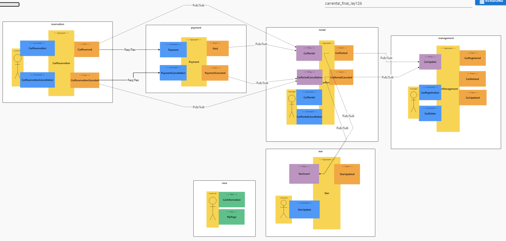
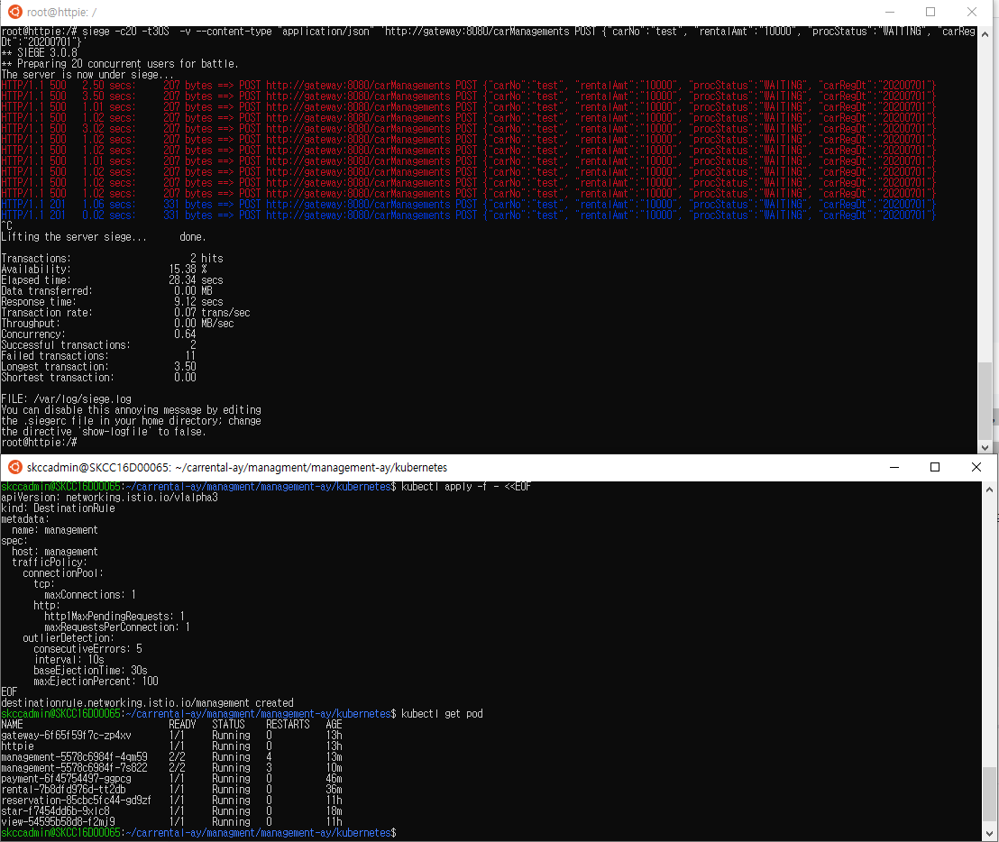
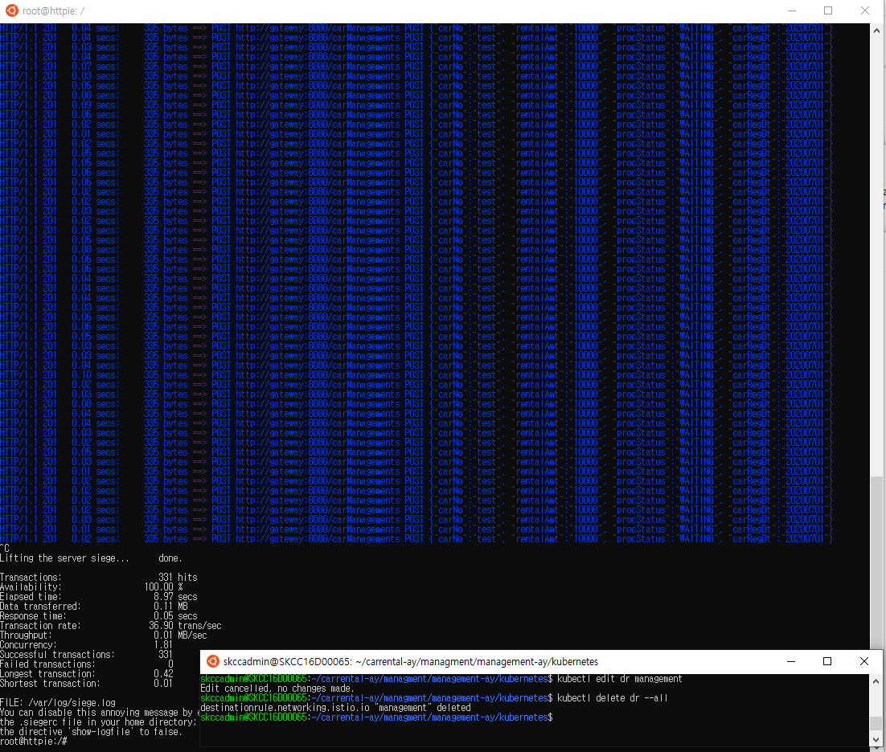
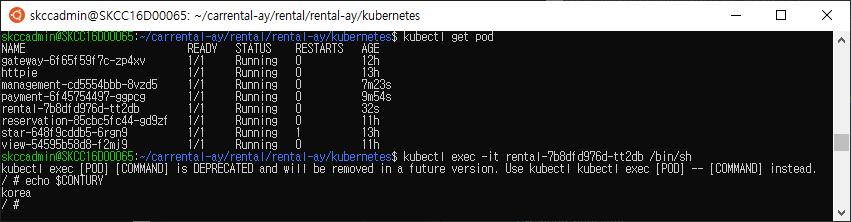
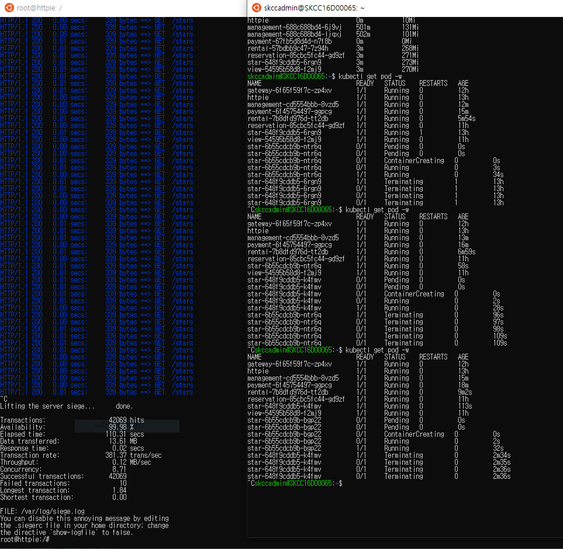
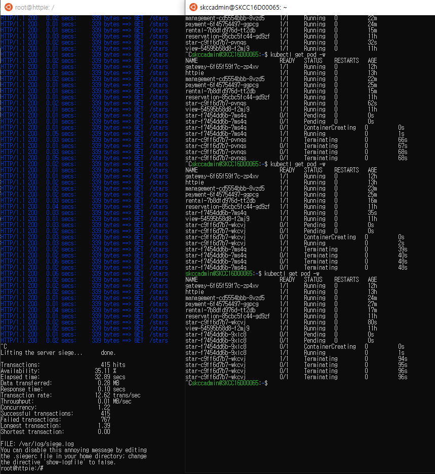

# 개인 과제 - 렌터카 서비스 + 별점 기능

---
# 서비스 시나리오

## 기능적 요구사항
1. 관리자는 대여 차량 정보를 등록/삭제 할 수 있다.
1. 고객은 차량의 정보를 조회할 수 있다.
1. 고객은 차량을 선택해 예약할 수 있다.
1. 고객은 예약한 정보를 예약취소 할 수 있다.
1. 고객이 예약 차량에 대해 결제를 완료하면 차량이 대여된다.
1. 고객이 결제를 취소하면 차량 대여정보도 취소된다.
1. 예약/결제/대여가 발생하면 차량의 상태가 변경된다.
1. 고객은 대여 진행 현황을 중간에 조회할 수 있다.
1. 고객은 차량 대여 후 별점으 부여 할 수 있다.


## 비기능적 요구사항
1. 트랜잭션
    1. 결제가 되지 않은 예약건은 차량 대여가 성립하지 않는다. (Sync 호출)
1. 장애격리
    1. 관리자 차량관리 기능이 수행되지 않더라도 예약은 항상 받을 수 있어야 한다. (Async:Event-driven, Eventual Consistency)
    1. 결제시스템이 과중되면 사용자를 잠시동안 받지 않고 결제를 잠시후에 하도록 유도한다. (Circuit breaker, fallback)
1. 성능
    1. 고객이 대여 현황을 예약 시스템에서 항상 확인 할 수 있어야 한다. (CQRS)
    1. 결제, 대여/반납 정보가 변경 될 때 마다 차량 재고가 변경될 수 있어야 한다. (Event driven)


### 개인 완성본

    
    

---
# 구현
분석/설계 단계에서 도출된 헥사고날 아키텍처에 따라, 각 BC별로 대변되는 마이크로 서비스들을 스프링부트와 자바로 구현하였다.    
구현한 각 서비스를 로컬에서 실행하는 방법은 아래와 같다 (각자의 포트넘버는 8081 ~ 808n 이다)

   
---
#### 적용 후 REST API 의 테스트   

##### A) 차량등록   
차량1 : http http://localhost:8085/carManagements carNo=car01 rentalAmt=10000 carRegDt=20200701 procStatus=WAITING   
   
   
차량2 : http http://localhost:8085/carManagements carNo=car02 rentalAmt=20000 carRegDt=20200702 procStatus=WAITING   
   
   
##### B) 예약   
예약1 : http http://localhost:8082/carReservations resrvNo=res20200801Seq0001 resrvDt=20200801 carNo=car01 rentalDt=20200806 returnDt=20200807 rentalAmt=50000 procStatus=RESERVED      
예약2 : http http://localhost:8082/carReservations resrvNo=res20200803Seq0001 resrvDt=20200803 carNo=car02 rentalDt=20200803 returnDt=20200805 rentalAmt=20000 procStatus=RESERVED      
예약2 취소 : http http://localhost:8082/carReservations id=2 resrvNo=res20200803Seq0001 resrvCncleDt=20200803 procStatus=RESERVATION_CANCELED   
   
##### C) 결제   
결제1 : http http://localhost:8083/payments id=1 resrvNo=res20200801Seq0001 paymtNo=pay20200801Seq0001 paymtDt=20200801  paymtAmt=50000 procStatus=PAID carNo=car01 rentalDt=20200806 returnDt=20200807 rentalAmt=50000     
   
결제취소1 : http http://localhost:8083/payments id=1 resrvNo=res20200801Seq0001 paymtNo=pay20200801Seq0001 paymtCncleDt=20200803 paymtAmt=50000 procStatus=PAYMENT_CANCELED carNo=car01    
 
   
##### D) 마이페이지   
http http://localhost:8084/myPages   
  
   
##### E) 별점부여 


---
# 운영
## CI/CD 설정
### 빌드/배포
각 프로젝트 jar를 Dockerfile을 통해 Docker Image 만들어 ECR저장소에 올린다.   
EKS 클러스터에 접속한 뒤, 각 서비스의 deployment.yaml, service.yaml을 kuectl명령어로 서비스를 배포한다.   
  - 코드 형상관리 : https://github.com/l2skcc 하위 repository에 각각 구성   
  - 운영 플랫폼 : AWS의 EKS(Elastic Kubernetes Service)   
  - Docker Image 저장소 : AWS의 ECR(Elastic Container Registry)
##### 배포 명령어
```
$ kubectl apply -f deployment.yaml
$ kubectl apply -f svc.yaml
```

# Liveness
pod의 container가 정상적으로 기동되는지 확인하여, 비정상 상태인 경우 pod를 재기동하도록 한다.   

아래의 값으로 liveness를 설정한다.
- 재기동 제어값 : /tmp/healthy 파일의 존재를 확인
- 기동 대기 시간 : 3초
- 재기동 횟수 : 5번까지 재시도

이때, 재기동 제어값인 /tmp/healthy파일을 강제로 지워 liveness가 pod를 비정상 상태라고 판단하도록 하였다.       
5번 재시도 후에도 파드가 뜨지 않았을 경우 CrashLoopBackOff 상태가 됨을 확인하였다.   
##### payment에 Liveness 적용한 내용
```yaml
apiVersion: apps/v1
kind: Deployment
...
    spec:
      containers:
        - name: payment
          image: 496278789073.dkr.ecr.ap-northeast-2.amazonaws.com/ecr-skcc-team2-payment:v1
          args:
          - /bin/sh
          - -c
          - touch /tmp/healthy; sleep 10; rm -rf /tmp/healthy; sleep 600;
...
          livenessProbe:                 #적용 부분
            exec:
              command:
              - cat
              - /tmp/healthy
            initialDelaySeconds: 3
            timeoutSeconds: 2
            periodSeconds: 5
            failureThreshold: 5
```
#### 테스트 결과 


---
# 서킷 브레이커
ISTIO, httpie 설치하여 테스트 환경을 만든다.  
각 마이크로 서비스의 deployment에 istio가 적용되어, istio컨테이너가 pod마다 sidecar로 기동 된것을 확인하였다.   

##### 서킷 브레이커 DestinationRule 생성
management 서비스에 대해 서킷 브레이커를 적용하였다.   
최대 1개의 http 연결만 받아들이고, 10초마다 확인하여(interval) 5개의 500에러가 발생하면(consecutiveErrors) 30초 동안 연결을 거부(baseEjectionTime)하도록 설정하였다.   
```
$ kubectl apply -f - <<EOF
apiVersion: networking.istio.io/v1alpha3
kind: DestinationRule
metadata:
  name: management
spec:
  host: management
  trafficPolicy:
    connectionPool:
      tcp:
        maxConnections: 1
      http:
        http1MaxPendingRequests: 1    # 최대 1개의 http 연결만
        maxRequestsPerConnection: 1
    outlierDetection:
      consecutiveErrors: 5     # 5개의 500에러가 발생
      interval: 10s            # 10초마다 확인
      baseEjectionTime: 30s    # 30초 동안 연결을 거부
      maxEjectionPercent: 100
EOF
```
##### httpie에서 management 서비스로 부하를 주었다.
```
siege -c20 -t30S  -v --content-type "application/json" 'http://gateway:8080/carManagements POST {"carNo":"test", "rentalAmt":"10000", "procStatus":"WAITING", "carRegDt":"20200701"}'
```

#### 서킷 브레이커 적용 시 결과 
아래와 같이 management 서비스에서 일부의 요청만 받아드리고, 허용치를 넘어서는 요청에서 대해서는 500을 응답주는것을 확인하였다.



#### 서킷 브레이커 DestinationRule 삭제 
management에 적용된 서킷 브레이커 DestinationRule을 삭제하고 다시 부하를 주어 결과를 확인한다.    
```
$ kubectl delete dr --all
```
아래와 같이 management서비스에서 모든 요청을 처리하여 200응답을 주는것을 확인하였다.


---
## RETRY
#### retry 리소스 생성
Retry테스트를 위하여 VirtualService 리소스를 생성하고 부하테스트를 하였으나, 예상한 결과값을 보지 못하였다.    
retries 설정값과 reservation pod의 수가 맞지 않는지, 모든 요청에 대하여 500응답을 주었다.
```
$ kubectl apply -f - <<EOF
apiVersion: networking.istio.io/v1alpha3
kind: VirtualService
metadata:
  name: reservation
spec:
  hosts:
  - reservation
  http:
  - route:
    - destination:
        host: reservation
    retries:
      attempts: 3
      perTryTimeout: 2s
EOF
```
#### 적용 상태에서 요청
```
$ siege -c5 -t30S  -v --content-type "application/json" 'http://gateway:8080/carReservations POST {"carNo":"car01", "custNo":"cus01", "paymtNo":"pay20200801Seq0001", "procStatus":"RESERVED", "rentalAmt":"10000", "resrvNo":"res20200801Seq0001", "resrvDt":"20200801", "rentalDt":"20200802", "returnDt":"20200805"}'
** SIEGE 3.0.8
** Preparing 5 concurrent users for battle.
The server is now under siege...
HTTP/1.1 500   0.04 secs:     257 bytes ==> POST http://gateway:8080/carReservations POST {"carNo":"car01", "custNo":"cus01", "paymtNo":"pay20200801Seq0001", "procStatus":"RESERVED", "rentalAmt":"10000", "resrvNo":"res20200801Seq0001", "resrvDt":"20200801", "rentalDt":"20200802", "returnDt":"20200805"}
HTTP/1.1 500   0.04 secs:     257 bytes ==> POST http://gateway:8080/carReservations POST {"carNo":"car01", "custNo":"cus01", "paymtNo":"pay20200801Seq0001", "procStatus":"RESERVED", "rentalAmt":"10000", "resrvNo":"res20200801Seq0001", "resrvDt":"20200801", "rentalDt":"20200802", "returnDt":"20200805"}
HTTP/1.1 500   0.04 secs:     257 bytes ==> POST http://gateway:8080/carReservations POST {"carNo":"car01", "custNo":"cus01", "paymtNo":"pay20200801Seq0001", "procStatus":"RESERVED", "rentalAmt":"10000", "resrvNo":"res20200801Seq0001", "resrvDt":"20200801", "rentalDt":"20200802", "returnDt":"20200805"}
HTTP/1.1 500   0.04 secs:     257 bytes ==> POST http://gateway:8080/carReservations POST {"carNo":"car01", "custNo":"cus01", "paymtNo":"pay20200801Seq0001", "procStatus":"RESERVED", "rentalAmt":"10000", "resrvNo":"res20200801Seq0001", "resrvDt":"20200801", "rentalDt":"20200802", "returnDt":"20200805"}
HTTP/1.1 500   0.02 secs:     257 bytes ==> POST http://gateway:8080/carReservations POST {"carNo":"car01", "custNo":"cus01", "paymtNo":"pay20200801Seq0001", "procStatus":"RESERVED", "rentalAmt":"10000", "resrvNo":"res20200801Seq0001", "resrvDt":"20200801", "rentalDt":"20200802", "returnDt":"20200805"}
.........
```

---
# HPA
management 서비스에 대하여 오토스케일러를 적용하여 확장적 운영이 가능하게 하였다. (실제로는 reservation 서비스에 적용하면 좋을것 같다.)   
테스트에 앞서, pod의 cpu 사용량을 오토스케일러에서 확인 할 수 있도록 metrics-server를 설치하였다.     

### autoscale 리소스 생성
management pod를 최소 2개로 유지하며, 평균 cpu 사용량를 20%를 유지하는 선에서 최대 pod개수를 10개까지 자동으로 늘린다.
```
kubectl autoscale deploy management --min=2 --max=10 --cpu-percent=20
```

### deployment 수정
management-deployment.yaml의 containers하위에 아래와 같이 container의 cpu limits과 requests를 설정한다.
```
containers:
   resources:
      limits: 
        cpu: 500m
      requests:
        cpu: 200m
```

### 부하 테스트 진행
```
# siege -r 2000 -c 200 -v http://gateway:8080/carManagements
```
httpie에서 management로 부하테스트를 진행하였다.    
- 부하가 들어갈수록 hpa에서 management의 cpu 사용량이 20%를 넘어 197%까지 순간적으로 늘어남을 확인 할 수 있다.
- 이에 따라 management의 replica 수가 2개에서 10개까지 증가한다.
- 10개까지 늘어단 management pod가 요청을 나누어 처리하면서 cpu사용량이 28%까지 줄어들었다.


```
kubectl delete hpa management
```

---
# configmap
rental 서비스의 경우, 국가와 지역에 따라 설정이 변할 수도 있음을 가정할 수 있다.   
configmap에 설정된 국가와 지역 설정을 rental 서비스에서 받아 사용 할 수 있도록 한다.   
   
아래와 같이 configmap을 생성한다.   
data 필드에 보면 contury와 region정보가 설정 되어있다. 
##### configmap 생성
```
$ kubectl apply -f - <<EOF
apiVersion: v1
kind: ConfigMap
metadata:
  name: rental-region
data:
  contury: "korea"
  region: "seoul"
EOF
```
   
rental deployment를 위에서 생성한 rental-region(cm)의 값을 사용 할 수 있도록 수정한다.
###### configmap내용을 deployment에 적용 
``` yaml
apiVersion: apps/v1
kind: Deployment
metadata:
  name: rental
  labels:
    app: rental
...
    spec:
      containers:
        - name: rental
          env:                                                 ##### 컨테이너에서 사용할 환경 변수 설정
            - name: CONTURY
              valueFrom:
                configMapKeyRef:
                  name: rental-region
                  key: contury
            - name: REGION
              valueFrom:
                configMapKeyRef:
                  name: rental-region
                  key: region
          volumeMounts:                                                 ##### CM볼륨을 바인딩
          - name: config
            mountPath: "/config"
            readOnly: true
...
      volumes:                                                 ##### CM 볼륨 
      - name: config
        configMap:
          name: rental-region
```

실제 rental pod안에서 cm에 설정된 국가와 지역 설정이 환경변수로 적용 된것을 확인 할 수 있다.



---
# 무중단 배포
서비스 중인 view의 docker image의 버전를 v3 -> v1로 변경한다.   
이때, view:v1이 정상적으로 무중단 배포 되는지를 확인하였다.

##### 부하 진행중
view 서비스에 조회하는 명령어를 300s동안 계속 던지고 있는다.


##### view 이미지의 version 변경
부하가 진행 되는 중에, view의 버전을 1으로 변경한다.
```
$ kubectl set image deploy view view=496278789073.dkr.ecr.ap-northeast-2.amazonaws.com/ecr-skcc-team2-veiw:v1
-
 deployment.extensions/view image updated
```

##### 무중단 배포 진행 
view-v1의 pod가 새로 배포가 완료되어 서비스 정상 상태가 된 후, 기존의 view-v3 pod가 중단 됨이 확인되었다.   
이렇게 진행되는 경우, 새로운 pod가 완전히 기동 된 후 기존 pod가 중단 되므로 view 서비스 중단이 발생하지 않는다.


이렇게 무중단 배포가 진행되는동안에 요청에 대한 응답도 계속 200으로 정상 결과를 반환한다.


# 무중단 배포 실패
deployment에서 liveness, readness를 제거하여 서비스 중단이 발생하여 Availability:18.17%의 가용성이 낮음을 확인한다.
 

